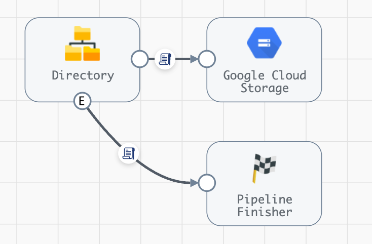
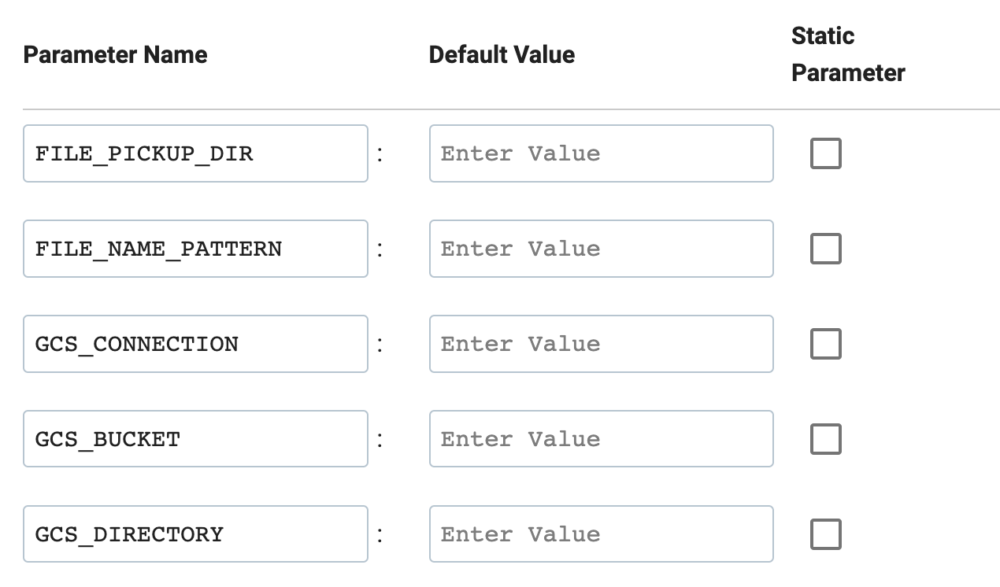
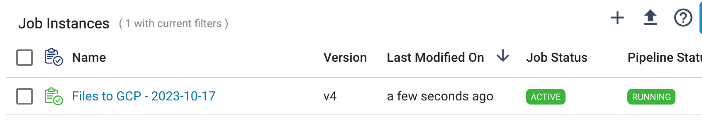
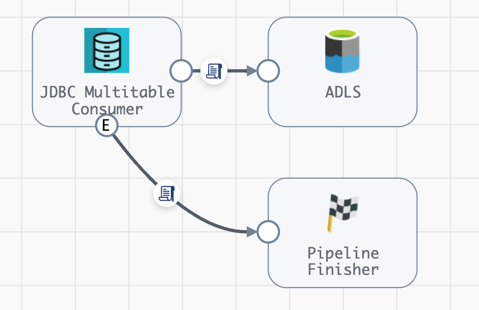
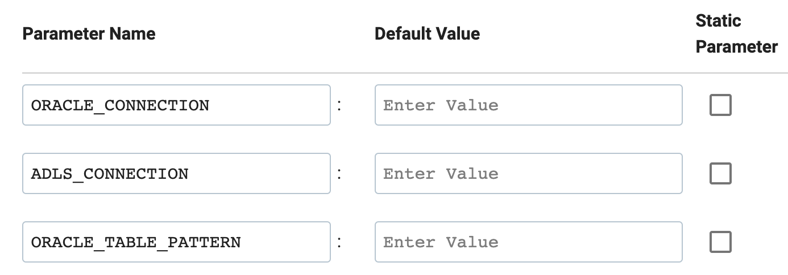
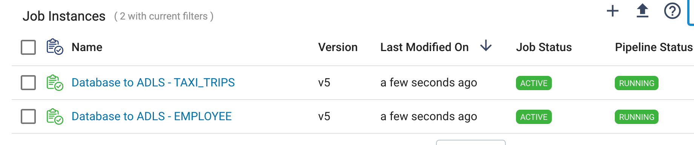

## streamsets-sdk-start-job-templates
This project provides examples of how to use the [StreamSets Platform SDK](https://docs.streamsets.com/platform-sdk/latest/index.html) to parameterize and  start Job Template instances based on settings in a JSON config file.


### Prerequisites

- Python 3.8+

 - StreamSets Platform SDK for Python v6.0.1+

- StreamSets Platform [API Credentials](https://docs.streamsets.com/portal/platform-controlhub/controlhub/UserGuide/OrganizationSecurity/APICredentials_title.html#concept_vpm_p32_qqb) for a user with permissions to start Jobs 

 - To avoid including API Credentials in the script, export these two environment variables
   prior to running the script:

        export CRED_ID=<your CRED_ID>>
        export CRED_TOKEN=<your CRED_TOKEN>

### Configuration Details

Create a JSON config file similar to the [examples](config) included
  in this project.  Specify the following properties:
  
- <code>job_template_id</code> 

- <code>instance_name_suffix</code>  - use one of these values: <code>"PARAM_VALUE", "COUNTER", "TIME_STAMP"</code>

- <code>parameter_name</code> - only needed if <code>instance_name_suffix</code> is set to <code>"PARAM_VALUE"</code>

- <code>attach_to_template</code> - set to <code>true</code> or <code>false</code>

- <code>delete_after_completion</code> - set to <code>true</code> or <code>false</code>

- <code>runtime_parameters</code> - A list of maps, with the list size determining the number of Job Tempalte Instances that will be created and started.  See the examples below.

### Running the script

 - To avoid including API Credentials in the script, export these two environment variables
   prior to running the script:

        export CRED_ID=<your CRED_ID>>
        export CRED_TOKEN=<your CRED_TOKEN>

- Run the script like this, passing in the path to a config file:

	<code>$ python start-job-template-instances.py ../config/xxx-template-properties.json</code>


### Example #1 - Files to GCP (A single instance)

Assume a Job Template built on a pipeline like this:




<BR/><BR/>The template requires these parameters:




A config file that could be used with this template to create one instance with a timestamp suffix might look like this:

```
{
  "job_template_id": "fb4d0b8a-8c49-45ff-ad64-62c231924352:8030c2e9-1a39-11ec-a5fe-97c8d4369386",
  "instance_name_suffix": "TIME_STAMP",
  "attach_to_template": true,
  "delete_after_completion": false,
  "runtime_parameters": [
    {
      "FILE_PICKUP_DIR": "/Users/mark/data/json",
      "FILE_NAME_PATTERN": "*.json",
      "GCS_CONNECTION": "9c960db9-7904-47c4-bbc8-4c95dcf9c959:8030c2e9-1a39-11ec-a5fe-97c8d4369386",
      "GCS_BUCKET": "146_gcs_bucket",
      "GCS_DIRECTORY": "files"
    }
  ]
}
```

Run the script using a command like this:

$ python start-job-template-instances.py ../config/files-to-gcp-template-properties.json
    
The script should write command line output like this:

```

$ python start-job-template-instances.py ../config/files-to-gcp-template-properties.json
Connecting to Control Hub
Looking for Job Template with ID 'fb4d0b8a-8c49-45ff-ad64-62c231924352:8030c2e9-1a39-11ec-a5fe-97c8d4369386'
Found Job Template with name 'Files to GCP'
---
Runtime Parameters for Job Template Instance 0:
FILE_PICKUP_DIR:/Users/mark/data/json
FILE_NAME_PATTERN:*.json
GCS_CONNECTION:9c960db9-7904-47c4-bbc8-4c95dcf9c959:8030c2e9-1a39-11ec-a5fe-97c8d4369386
GCS_BUCKET:146_gcs_bucket
GCS_DIRECTORY:files
---
Starting 1 Job Template Instance
Done

```


You should see one Job Template Instance is launched, with a timestamp suffix:




### Example #2 - Database to ADLS (Two instances)

Assume a Job Template built on a pipeline like this:




<BR/><BR/>The template requires these parameters:




A config file that could be used with this template to create two instance with the Oracle table name as a suffix might look like this:

```
{
  "job_template_id": "187cba47-bef6-474e-882d-8f4445a66f5e:8030c2e9-1a39-11ec-a5fe-97c8d4369386",
  "instance_name_suffix": "PARAM_VALUE",
  "parameter_name": "ORACLE_TABLE_PATTERN",
  "attach_to_template": true,
  "delete_after_completion": false,
  "runtime_parameters": [
    {
      "ORACLE_CONNECTION": "86a76b7c-0ad9-4da4-8e48-3be048593c40:8030c2e9-1a39-11ec-a5fe-97c8d4369386",
      "ADLS_CONNECTION": "0a13edd2-d12d-41a1-be13-3da331d87820:8030c2e9-1a39-11ec-a5fe-97c8d4369386",
      "ORACLE_TABLE_PATTERN": "EMPLOYEE"
    },
    {
      "ORACLE_CONNECTION": "86a76b7c-0ad9-4da4-8e48-3be048593c40:8030c2e9-1a39-11ec-a5fe-97c8d4369386",
      "ADLS_CONNECTION": "0a13edd2-d12d-41a1-be13-3da331d87820:8030c2e9-1a39-11ec-a5fe-97c8d4369386",
      "ORACLE_TABLE_PATTERN": "TAXI_TRIPS"
    }
  ]
}
````

Run the script using a command like this:

    $ python start-job-template-instances.py ../config/database-to-adls-template-properties.json


The script should write command line output like this:

```
$ python start-job-template-instances.py ../config/database-to-adls-template-properties.json
Connecting to Control Hub
Looking for Job Template with ID '187cba47-bef6-474e-882d-8f4445a66f5e:8030c2e9-1a39-11ec-a5fe-97c8d4369386'
Found Job Template with name 'Database to ADLS'
---
Runtime Parameters for Job Template Instance 0:
ORACLE_CONNECTION:86a76b7c-0ad9-4da4-8e48-3be048593c40:8030c2e9-1a39-11ec-a5fe-97c8d4369386
ADLS_CONNECTION:0a13edd2-d12d-41a1-be13-3da331d87820:8030c2e9-1a39-11ec-a5fe-97c8d4369386
ORACLE_TABLE_PATTERN:EMPLOYEE
---
Runtime Parameters for Job Template Instance 1:
ORACLE_CONNECTION:86a76b7c-0ad9-4da4-8e48-3be048593c40:8030c2e9-1a39-11ec-a5fe-97c8d4369386
ADLS_CONNECTION:0a13edd2-d12d-41a1-be13-3da331d87820:8030c2e9-1a39-11ec-a5fe-97c8d4369386
ORACLE_TABLE_PATTERN:TAXI_TRIPS
---
Starting 2 Job Template instances
Done
```

You should see two Job Template Instances are launched, with table name suffixes:




